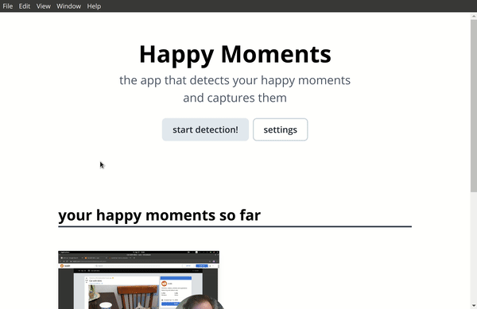

# Happy Moments

**Project submission for _Creative Coding II: Advanced Frameworks_**

The aim of this project was developing an app that reads webcam input and performs emotion classification in the background. Every time it detects a happy face, it saves a photo and a screenshot of the current screen and creates a gallery of all the happy moments that the person had using the device.

## Repository Structure

This repository consists out of three parts:

- **pyFace**  
  First attempt at face detection and creating an emotion classification using Python and a pre-trained Convolutional Neural Network.

- **ofxFace**  
  An OpenFrameworks application for running emotion classification on a webcam input, using the [FaceTracker](https://facetracker.net/) library.

- **electronFace**  
  A desktop GUI for the application, built with [Electron](https://www.electronjs.org/) framework. Written in TypeScript and React.

You can see more details about the individual programs and how to install and run them in the README-files of their respective folders.

_(Projects were developed and tested on ElementaryOS 5.1, but should work across all plattforms.)_

## Project Overview

The project consists out two parts, a script running face detection and emotion classification, and a GUI that controls the script and displays the captured faces. My inital attempt was creating the classification script with python, using an existing python [face recognition library](https://github.com/ageitgey/face_recognition). However, the performance turned out to be too unreliable for the purposes of this application. The python script can be found under the `pyFace` folder for documentation purposes.

The final application that was used for the project was written in C++ and OpenFrameworks, utilising the `ofxFaceTracker` plugin. This part of the application detects whenever a happy face is present and saves a photo of the face.

Lastly, the GUI starts and stops the face detection program, takes a screenshot of the current screen, and displays all the happy moments in a gallery. It can also pass some configuration settings to the C++ app.

## Demonstration

Here's a demonstration of the working program:

